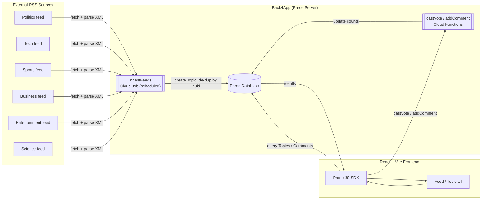
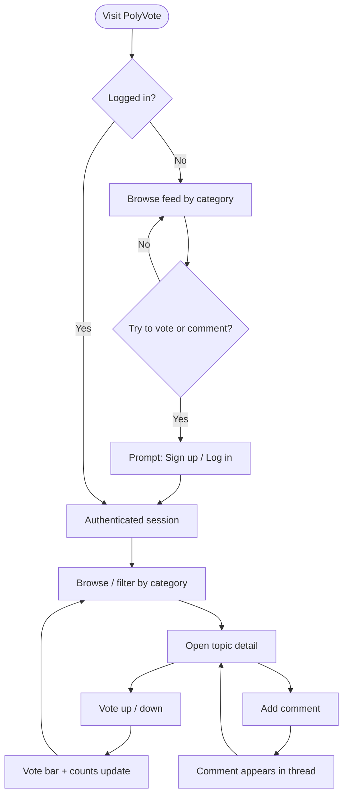
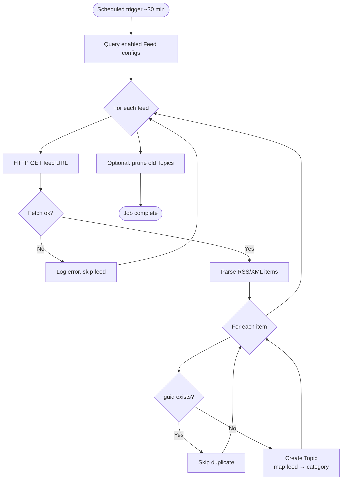
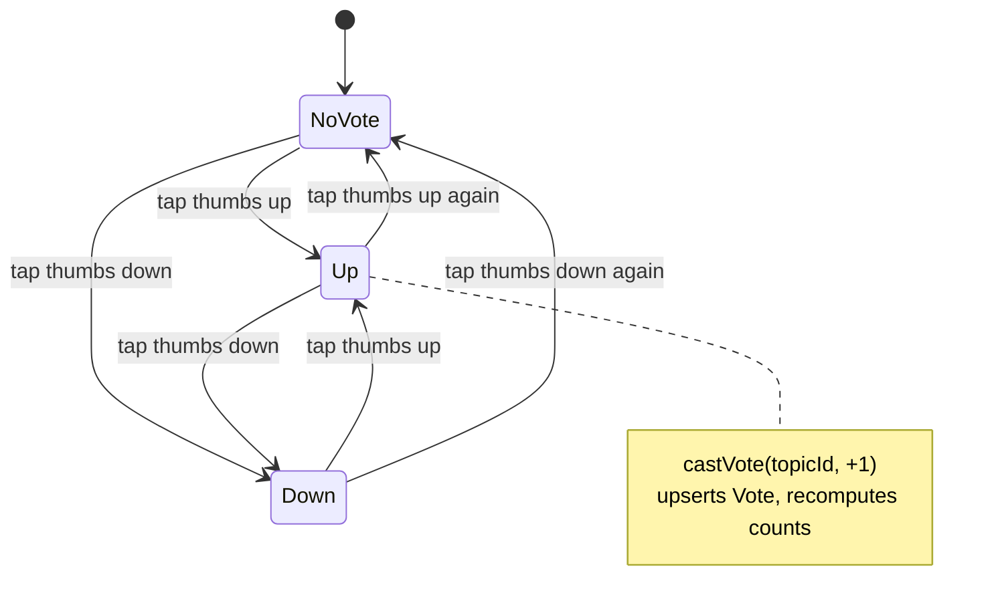
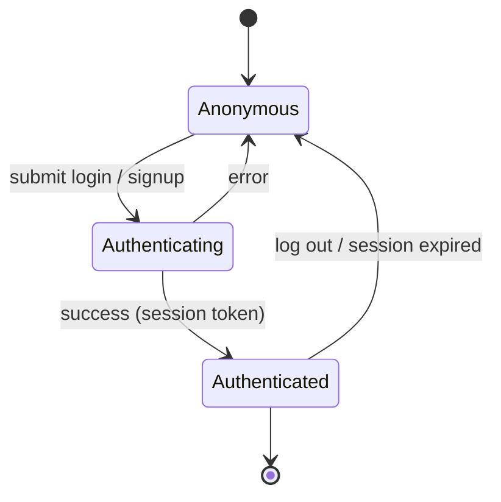
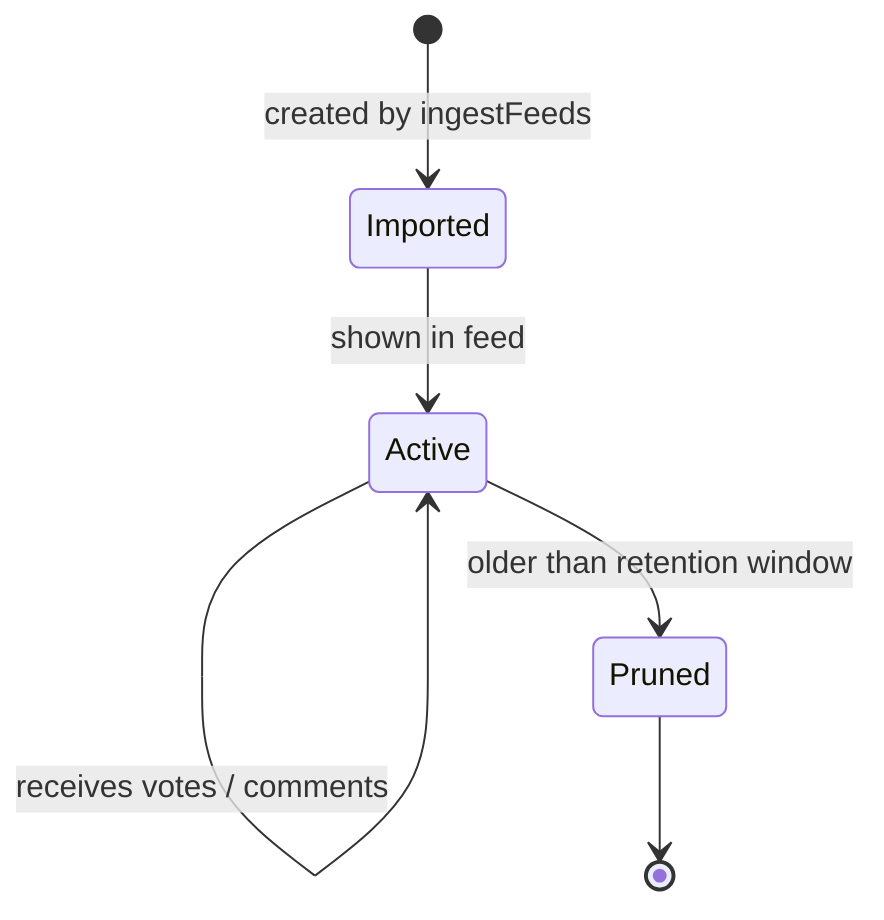
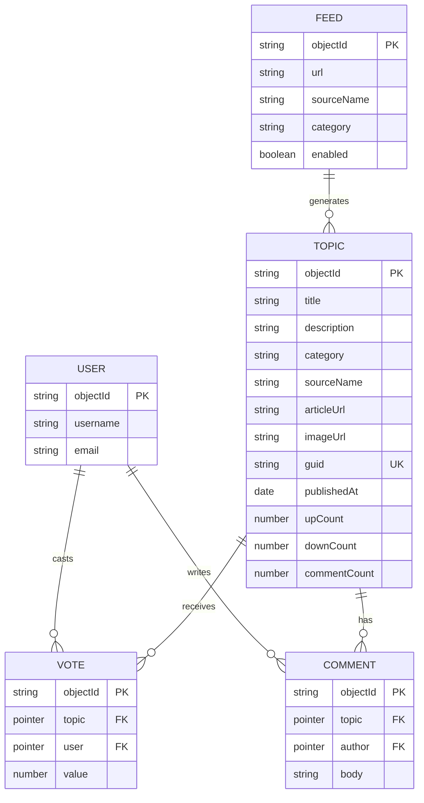
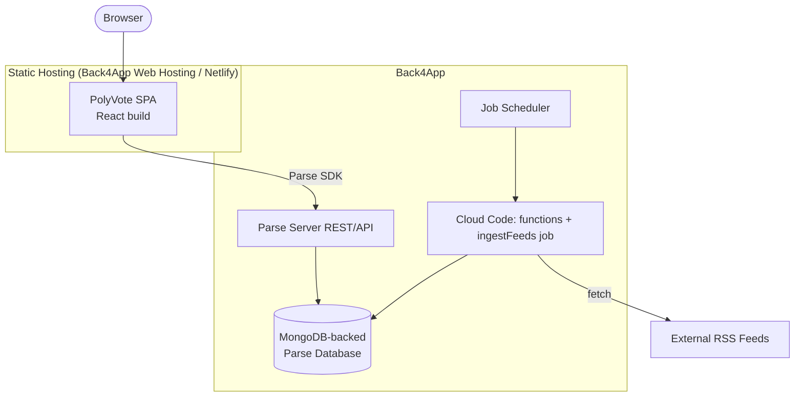
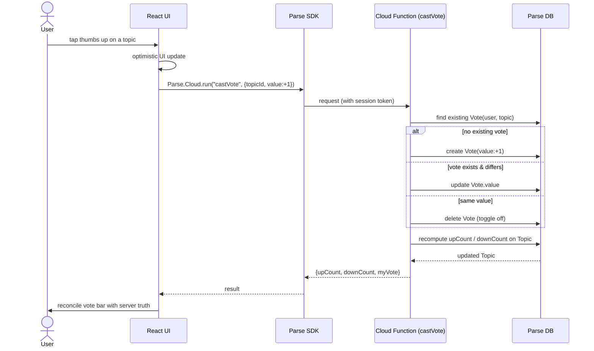
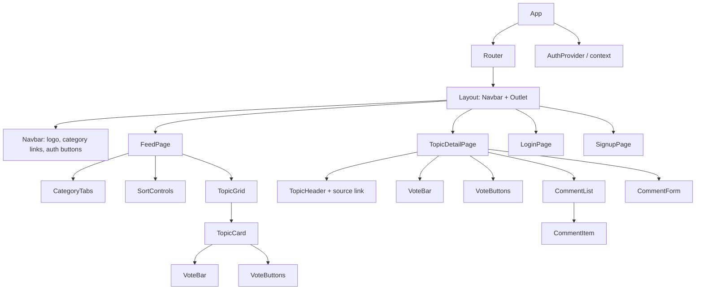

# PolyVote — Diagrams

Mermaid diagrams for the RSS-based PolyVote app. View in any Mermaid-capable Markdown
previewer.

---

## 1. Flow Diagrams

### 1a. System / Data Flow

### 1b. User Journey

### 1c. RSS Ingestion Job

---

## 2. State Diagrams

### 2a. User's Vote on a Topic

### 2b. Authentication Session

### 2c. Topic Lifecycle

---

## 3. Resource Diagram (Data Model)

### Deployment / Resource Topology

---

## 4. Sequence Diagram — Casting a Vote

---

## 5. Frontend Component Hierarchy

