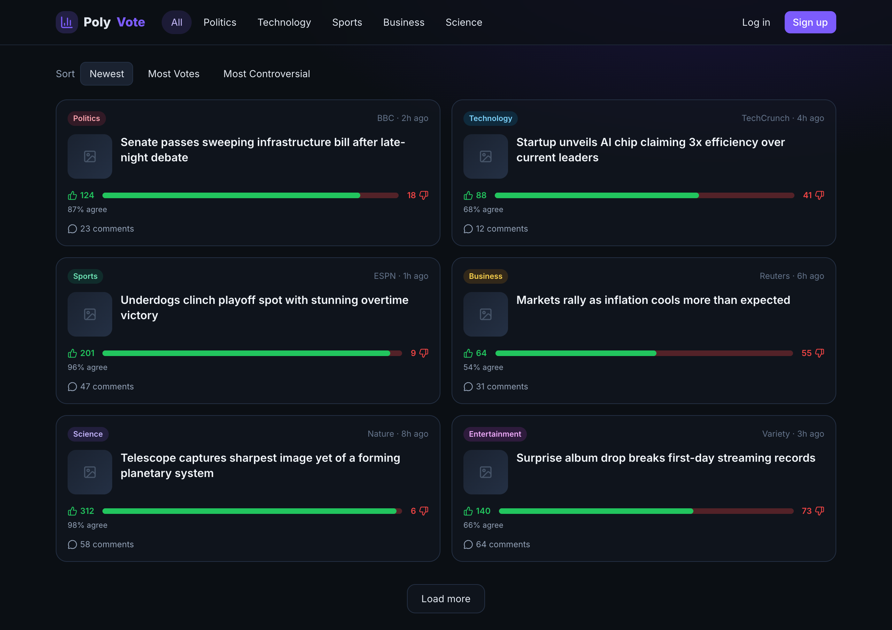
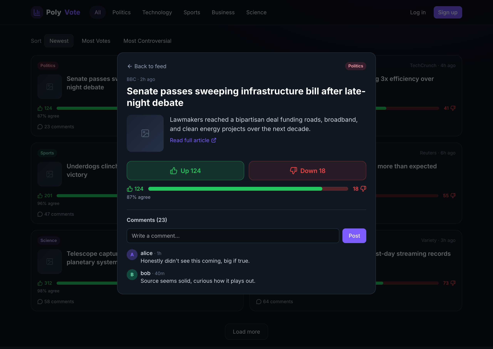

# PolyVote — UI Mockups

High-fidelity renders of the **modern dark** theme, captured from the clickable
[`mockup.html`](./mockup.html) prototype. Low-fi wireframes follow for layout reference.

---

## High-Fidelity Renders

### Feed Page
News cards in a responsive 2-column grid, with category badges, source/time, animated
green (up) / red (down) vote bars, agreement %, and comment counts.



### Topic Detail
Click any card to open the detail view: full headline, summary, "Read full article"
link, large up/down vote buttons, vote bar, and a comment thread.



> Regenerate these images anytime: start the preview server, then run
> `node scripts/screenshot.js`.

---

## Wireframes (layout reference)

Low-fidelity wireframes for the **modern dark** theme. These show layout/structure;
final styling = near-black bg, glassy rounded cards, green (up) / red (down) accents.

Legend: `[ ]` button · `( )` toggle/link · `▲ ▼` vote thumbs · `███` filled vote bar

---

## 1. Feed Page (desktop)

```
┌──────────────────────────────────────────────────────────────────────┐
│  ▣ PolyVote      All  Politics  Tech  Sports  Business  Sci   ( Log in )│
├──────────────────────────────────────────────────────────────────────┤
│  Sort:  ( Newest ) ( Most Votes ) ( Most Controversial )               │
│                                                                        │
│  ┌────────────────────────────┐   ┌────────────────────────────┐      │
│  │ [img]        [Politics]     │   │ [img]        [Technology]   │      │
│  │ Headline goes here, up to   │   │ Another headline about a    │      │
│  │ two lines of text...        │   │ new gadget launch...        │      │
│  │ BBC · 2h ago                │   │ TechCrunch · 4h ago         │      │
│  │ ▲ 124      ▼ 18             │   │ ▲ 88       ▼ 41             │      │
│  │ ███████████████░░░  87%     │   │ █████████░░░░░░░░  68%      │      │
│  │ 💬 23 comments              │   │ 💬 12 comments              │      │
│  └────────────────────────────┘   └────────────────────────────┘      │
│  ┌────────────────────────────┐   ┌────────────────────────────┐      │
│  │ [img]        [Sports]       │   │ [img]        [Business]     │      │
│  │ ...                         │   │ ...                         │      │
│  └────────────────────────────┘   └────────────────────────────┘      │
│                          ( Load more )                                 │
└──────────────────────────────────────────────────────────────────────┘
```

---

## 2. Topic Detail Page

```
┌──────────────────────────────────────────────────────────────────────┐
│  ▣ PolyVote                                       user_name  ( Log out )│
├──────────────────────────────────────────────────────────────────────┤
│  ( ← Back to feed )                                                    │
│                                                                        │
│  [Politics]   BBC · 2h ago                                             │
│  Full headline of the news article displayed large                    │
│  ───────────────────────────────────────────────────────────────────  │
│  [ article thumbnail ]   Short summary / snippet from the RSS feed     │
│                          ( Read full article ↗ )                       │
│                                                                        │
│   ┌─────────────┐   ┌─────────────┐                                    │
│   │  ▲  Up 124  │   │  ▼ Down 18  │      Your vote: ▲                  │
│   └─────────────┘   └─────────────┘                                    │
│   ███████████████████████░░░░  87% agree                               │
│                                                                        │
│  ── Comments (23) ─────────────────────────────────────────────────   │
│  ┌──────────────────────────────────────────────────────────────────┐ │
│  │ Write a comment...                                       [ Post ] │ │
│  └──────────────────────────────────────────────────────────────────┘ │
│  ● alice · 1h     This is a take on the story...                       │
│  ● bob   · 40m    Replying thoughts here...                            │
└──────────────────────────────────────────────────────────────────────┘
```

---

## 3. Auth — Login / Signup

```
┌───────────────────────────────┐      ┌───────────────────────────────┐
│            ▣ PolyVote          │      │            ▣ PolyVote          │
│         Welcome back           │      │        Create account          │
│  ┌─────────────────────────┐   │      │  ┌─────────────────────────┐   │
│  │ Username                 │   │      │  │ Username                 │   │
│  └─────────────────────────┘   │      │  └─────────────────────────┘   │
│  ┌─────────────────────────┐   │      │  ┌─────────────────────────┐   │
│  │ Password                 │   │      │  │ Email                    │   │
│  └─────────────────────────┘   │      │  └─────────────────────────┘   │
│        [   Log in   ]          │      │  ┌─────────────────────────┐   │
│  No account? ( Sign up )       │      │  │ Password                 │   │
│                                │      │  └─────────────────────────┘   │
│                                │      │        [  Sign up  ]           │
│                                │      │  Have an account? ( Log in )   │
└───────────────────────────────┘      └───────────────────────────────┘
```

---

## 4. Mobile Feed (responsive)

```
┌───────────────────────┐
│ ▣ PolyVote      ( ☰ )  │
├───────────────────────┤
│ All Politics Tech ►    │   ← horizontally scrollable tabs
│ ( Newest ▾ )           │
│ ┌───────────────────┐  │
│ │ [img]  [Politics] │  │
│ │ Headline text...  │  │
│ │ BBC · 2h          │  │
│ │ ▲124   ▼18        │  │
│ │ ██████████░░ 87%  │  │
│ │ 💬 23             │  │
│ └───────────────────┘  │
│ ┌───────────────────┐  │
│ │ [img]  [Tech]     │  │
│ │ ...               │  │
│ └───────────────────┘  │
└───────────────────────┘
```

---

## 5. States to design (don't forget)

- **Loading** — skeleton cards (shimmer) while Topics load.
- **Empty** — "No stories yet — feeds refresh every 30 min."
- **Logged-out vote attempt** — inline prompt / modal to log in.
- **Error** — toast on failed vote/comment with retry.
- **Voted confirmation** — subtle animation on the vote bar.
